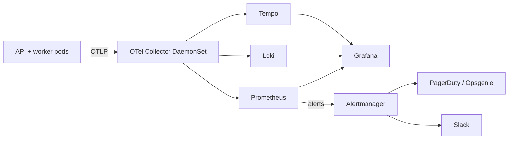

# Enterprise 04 — Observability at Scale

This overlay extends the local Prometheus + Grafana stack into a full observability platform suitable for on-call rotations and SLO-driven operations.

## What this overlay adds

- **Loki** for structured logs (the local profile points Grafana at local files).
- **Tempo** for distributed traces (the local profile drops trace spans on the floor after the Grafana dashboard view).
- **OTel Collector** as a DaemonSet with sampling tiers and tail-based sampling for errors.
- **SLO recording rules** + burn-rate alerts (1-h fast, 6-h slow).
- **Runbook URLs** required on every alert; lint step fails any alert without one.
- **Dashboards** for tenants, queue, inference, GPU, API health.
- **Log-volume budget** + truncation counter.

## Stack



The local profile keeps Prometheus + Grafana + OTel Collector but stops short of Loki + Tempo + Alertmanager. Adding them is a Helm subchart toggle.

## OTel Collector configuration

Pipelines:

- `traces`: OTLP receiver → tail-sampling processor (always sample errors; head sample 10% of successes in prod, 100% in staging) → Tempo exporter.
- `metrics`: OTLP receiver → batch processor → Prometheus remote-write.
- `logs`: OTLP receiver → batch processor → Loki exporter.

Resource attributes (`service.name`, `service.version`, `deployment.environment`, `tenant.id`) are added by an attribute processor so every signal is multi-tenancy-aware.

## Log-correlation requirement

Every line — API, worker, beat, dispatcher — carries:

```
ts, level, service, version,
request_id, trace_id, span_id,
tenant_id, owner_id, job_id (when applicable),
msg, model_id?, gpu_class?, gpu_index?,
duration_ms?, gpu_mem_alloc_mb?, error_code?
```

`request_id` is generated by the API middleware if missing and propagated to the worker via the Celery payload (alongside `traceparent`). Tracing requires this for the join.

PromQL or LogQL filter `tenant_id="…"` scopes any view to one tenant's traffic without cross-contamination — the single most important enterprise property.

## SLOs (enterprise targets)

| SLO | Window | Target | Burn-rate alerts |
|---|---|---|---|
| API availability | 30 d | 99.9% (5xx-rate) | Fast (1 h ≥ 14×) + slow (6 h ≥ 6×) |
| Job success rate (post-validation) | 30 d | 99.0% | Fast (1 h ≥ 14×) |
| P95 inference latency `(model_id, gpu_class)` | 7 d | model-specific (e.g. SAM3 on A100-40G ≤ 800 ms for 1024² image, batch 1; DA3 monocular on A100 ≤ 600 ms) | 1 h burn |

Validation errors (4xx) excluded from job success rate; user error must not page. Cancellations excluded from both directions.

Recording rule:

```yaml
- record: job:success_ratio:rate30d
  expr: |
    (sum(rate(worker_jobs_total{outcome="succeeded"}[30d])))
    /
    (sum(rate(worker_jobs_total{outcome=~"succeeded|failed"}[30d])))
```

## Burn-rate alerts

Multi-window, multi-burn-rate per Google's SRE workbook:

```yaml
- alert: APIAvailabilityBurnFast
  expr: |
    (sum(rate(http_requests_total{status=~"5.."}[1h])) / sum(rate(http_requests_total[1h]))) > (14 * 0.001)
  for: 5m
  labels: { severity: page }
  annotations:
    summary: "API 5xx burn rate is fast"
    runbook_url: "https://runbooks.intra/sam3/api-availability"
```

Lint step in CI fails any alert without `runbook_url`.

## Dashboards

Pre-loaded under `infra/grafana/dashboards/`. Each ships in two variants (local single-tenant, enterprise multi-tenant):

1. **API health** — RPS by route, P95 latency, 4xx/5xx, rate-limit blocks, idempotency replays.
2. **Queue depth** — per-queue length, oldest message age, redelivery rate.
3. **Inference** — P50/P95 by `(model_id, gpu_class)`, batch size distribution, OOM rate, cold-start frequency.
4. **GPU** — `worker_gpu_mem_used_mb` per `gpu_index`, evictions, warm-pool load state.
5. **Tenants** (enterprise only) — top tenants by jobs/min, by GPU-seconds, by failure rate, by webhook DLQ depth.

## Alerts

| Alert | Condition | Severity |
|---|---|---|
| API 5xx burst | rate of 5xx > 1% over 5 m | page |
| Queue stuck | oldest message age > 10 min | page |
| Worker no heartbeats | `rate(worker_heartbeats_total[2m])==0` and pods exist | page |
| OOM storm | `rate(worker_oom_total[10m]) > 0.2` | warn |
| Webhook DLQ growing | undelivered webhooks > 50 for > 30 min | warn |
| DB connection saturation | active conns > 80% pool | warn |
| Redis memory > 80% | from redis exporter | warn |
| Cert expiring | < 14 d | warn |
| SLO burn fast (api availability) | see above | page |
| SLO burn slow (api availability) | see above | warn |
| Job success burn fast | see above | page |

## On-call runbooks

Each runbook is one page. Required sections:

1. **What just happened** — what the alert means in plain language.
2. **Validate** — three commands the on-call runs to confirm the alert is real.
3. **Mitigate** — the standing escalation: drain a worker, roll the API, throttle a tenant.
4. **Diagnose** — the LogQL / PromQL / Tempo queries that surface the root cause.
5. **Fix** — links to known issues / PRs.
6. **Postmortem template** — the link to file one if this incident lasts > 30 min.

The "correlate from `request_id` to `trace_id` to `worker.run_task` span" walk is the canonical first step for any user complaint.

## Log volume budget

Default retention: 14 d hot, 90 d cold (S3-backed). Per-line size budget < 2 KB; oversized lines trimmed by the OTel processor with a counter `log_lines_truncated_total{service}`. A burn-rate alert fires if truncation rate > 1% of lines in any service.

## Tests

- `tests/enterprise/observability/test_alert_rules_have_runbooks.py`: lint step over the rendered alert rules.
- `tests/enterprise/observability/test_slo_recording_rules.py`: compute the recording rule against a synthetic Prometheus response; assert correctness.
- `tests/enterprise/observability/test_log_schema.py`: every log line passes a JSON schema with the required correlation fields.
