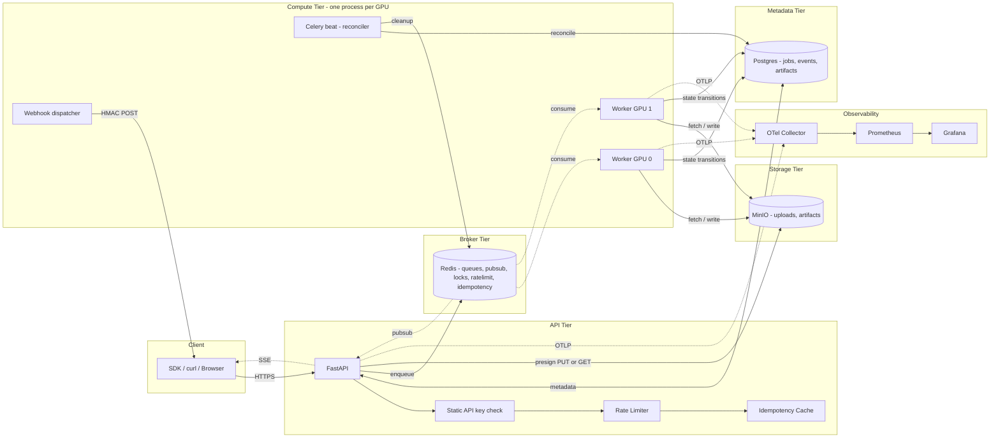
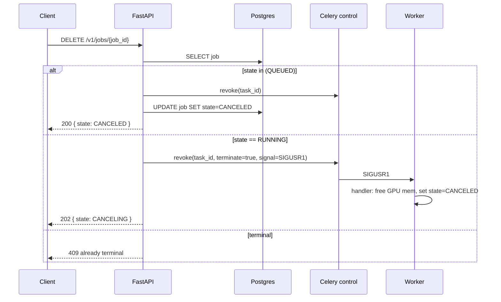

# 01 — Refined Architecture

This document refines the target architecture in `PLAN.md` and resolves the gaps from `00-evaluation.md`. The high-level four-tier split (API / Broker / Worker / Storage) is preserved; this document adds the components that were implicit and clarifies data flow.

## Two deployment profiles

The architecture has one shape but two profiles:

| Profile | Audience | Lives in | Notes |
|---|---|---|---|
| **Local** | this repo's primary user; portfolio + research | `infra/compose/` | Single host, 1–2 GPUs, Docker Compose. Cross-platform: Windows (WSL2 for GPU) + Ubuntu. Single static API key. |
| **Enterprise** | downstream adopter | [`enterprise/`](../enterprise/) | Kubernetes / Helm, multi-tenancy, JWT/OIDC, KEDA, External Secrets, KMS, multi-region. Layered on top of the same packages. |

Everything in this folder describes the **local** profile by default; enterprise overlays are pointed to from each section.

## High-level diagram (local profile)



The enterprise overlay adds: Ingress + WAF, KMS, Loki, Tempo, multi-region replication, multi-tenant `tenants`/`api_keys`/`audit` tables, OIDC. See [`enterprise/`](../enterprise/).

## Components

| Component | Tier | Responsibility | Local profile | Enterprise add-ons |
|---|---|---|---|---|
| **FastAPI** | API | Auth, validation, idempotency, enqueue, presign, status reads | Single static API key from `.env`. Stateless. No GPU. Never decodes user images. | JWT + OIDC + per-key scopes; Ingress + WAF |
| **Postgres** | Metadata | Source of truth for `jobs`, `job_events`, `artifacts`, `webhook_deliveries` | Single instance via Compose | Primary + standby; managed; HA failover |
| **Redis** | Broker | Celery queues, idempotency cache, rate-limit token buckets, distributed locks, pub/sub for SSE | Single instance | Sentinel/cluster; AOF persistence |
| **Celery worker** | Compute | Pulls from Redis; runs `TaskSpec.run`; writes state to Postgres; uploads artifacts | One process per detected GPU (1 or 2 in local) | Pod replicas = #GPUs in pool; KEDA queue-driven scale |
| **Celery beat** | Compute | Scheduler. Runs reconciler, lifecycle sweeper, webhook retry | Single instance | Single replica with leader-election (Redis SETNX) |
| **Webhook dispatcher** | Compute | Sends signed callbacks to client URLs | Same process pool as workers (separate Celery queue) | Dedicated deployment; HPA on outbound queue |
| **MinIO / S3** | Storage | Stores user uploads (`uploads/`) and result artifacts (`artifacts/`) | MinIO via Compose | S3 with KMS, lifecycle, versioning, IRSA |
| **OTel Collector** | Obs | Receives OTLP from API + worker, fans out to Prom + (Loki + Tempo) | Sidecar in Compose | DaemonSet; sampling tiers |

## Request lifecycles

### Submit a depth.monocular job

```mermaid
sequenceDiagram
    participant C as Client
    participant API as FastAPI
    participant DB as Postgres
    participant R as Redis
    participant W as Worker (GPU)
    participant S3 as MinIO

    C->>API: POST /v1/uploads (Idempotency-Key)
    API->>API: auth (static key), rate-limit
    API->>S3: presign PUT (key uploads/local/{uuid})
    API-->>C: { upload_url, image_ref }

    C->>S3: PUT image bytes (direct)

    C->>API: POST /v1/tasks/depth.monocular<br/>{ ImageInput, callback_url? }<br/>Idempotency-Key
    API->>API: auth, rate-limit, idempotency check
    API->>DB: INSERT job (state=QUEUED) returning id
    API->>R: enqueue celery task with traceparent + job_id
    API-->>C: 202 { job_id, state: QUEUED }

    W->>R: BRPOP from task.depth.monocular.<gpu>
    W->>DB: UPDATE job SET state=RUNNING WHERE id=:id AND state=QUEUED
    W->>S3: GET image_ref
    W->>W: oom_guard.check(); WarmPool.ensure_loaded("depth_anything_v3"); infer
    W->>S3: PUT artifacts/local/{job_id}/depth.png + depth_meta.json
    W->>DB: UPDATE job SET state=SUCCEEDED, artifacts=[...], finished_at=now()
    W->>R: PUBLISH job.events { job_id, state: SUCCEEDED }

    C->>API: GET /v1/jobs/{job_id} (or SSE subscribe)
    API->>DB: SELECT
    API-->>C: { state, output: DepthMapOutput, artifacts: [...] }
```

### Cancel a running job



## Deltas vs `PLAN.md`

| Topic | `PLAN.md` | This document |
|---|---|---|
| State writers | API + worker both write to `JobRecord` | API writes initial `QUEUED`; only worker mutates after that |
| Cancellation | Not defined | First-class `DELETE` endpoint with two modes |
| Webhooks | Not defined | Dedicated dispatcher, HMAC, retries |
| Trace propagation | Vague | Explicit Celery header injection at submit |
| Reconciler home | Mentioned, no host | Celery beat with leader election |
| Queue routing | Per `TaskType` | Per `TaskType × gpu_class` |
| Batching | Flag exists, unused | Per-queue micro-batcher in worker |
| Schema versioning | `/v1` prefix only | Path *and* model `version` field, with deprecation header policy |
| I/O typing | `Modality` string enum | Typed Pydantic class hierarchy in `packages/io/`; see [04a](./04a-io-types.md) |
| Models | SAM3 + SAM2 + depth (placeholder) | SAM3 + Depth Anything 3; SAM2/pose/recon dropped from v2.0 scope |
| Auth | JWT + API key + OIDC all from day 1 | Local: single static API key. Full auth → enterprise overlay |
| Tenancy | Multi-tenant tables in core | Single-tenant local profile. Multi-tenant → enterprise overlay |
| Deployment | Compose + Helm/K8s as peers | Compose is the primary, supported deployment. K8s/Helm is enterprise overlay |
| Compatibility shim | Implicit hard cutover | One-version compat shim with `Sunset` header |

## Process and replica counts (local profile)

| Component | Replicas | Sized by |
|---|---|---|
| API | 1 (Compose) | not relevant locally |
| Worker per GPU | One process per detected GPU (1 or 2) | `nvidia-smi` count at boot |
| Celery beat | 1 | n/a |
| Webhook dispatcher | shares worker pool (non-GPU queue) | n/a |
| Postgres | 1 | n/a |
| Redis | 1 | n/a |
| MinIO | 1 | n/a |
| OTel Collector + Prometheus + Grafana | 1 each | n/a |

Enterprise replica counts and HPA/KEDA wiring live in [`enterprise/02-kubernetes-and-helm.md`](../enterprise/02-kubernetes-and-helm.md).

## Cross-platform support

The local profile must work on:

- **Windows 10/11** + Docker Desktop + WSL2 (CUDA via Microsoft NVIDIA driver). `scripts/bootstrap_dev.ps1` checks WSL2 + `nvidia-smi.exe` and emits a clear error if missing.
- **Ubuntu 22.04+** + Docker Engine + NVIDIA Container Toolkit. `scripts/bootstrap_dev.sh` checks `nvidia-smi` and `nvidia-container-runtime`.

CPU-only fallback is supported for the API + tests but not for inference (both SAM3 and DA3 require CUDA at runtime). The compose profile `cpu` brings up everything except `worker-gpu-*`; useful for API integration tests.

## What is *not* in scope here

- HA/DR runbooks → [`enterprise/05-multi-region-and-ha.md`](../enterprise/05-multi-region-and-ha.md).
- Multi-region active-active → enterprise.
- Streaming / chunked-video inference → reserved I/O class (`VideoInput`) but no adapter in v2.0.
- Multi-GPU model sharding inside one process → out of scope; each adapter must fit on one GPU class.

These remain non-goals for v2.0 of the local profile.
