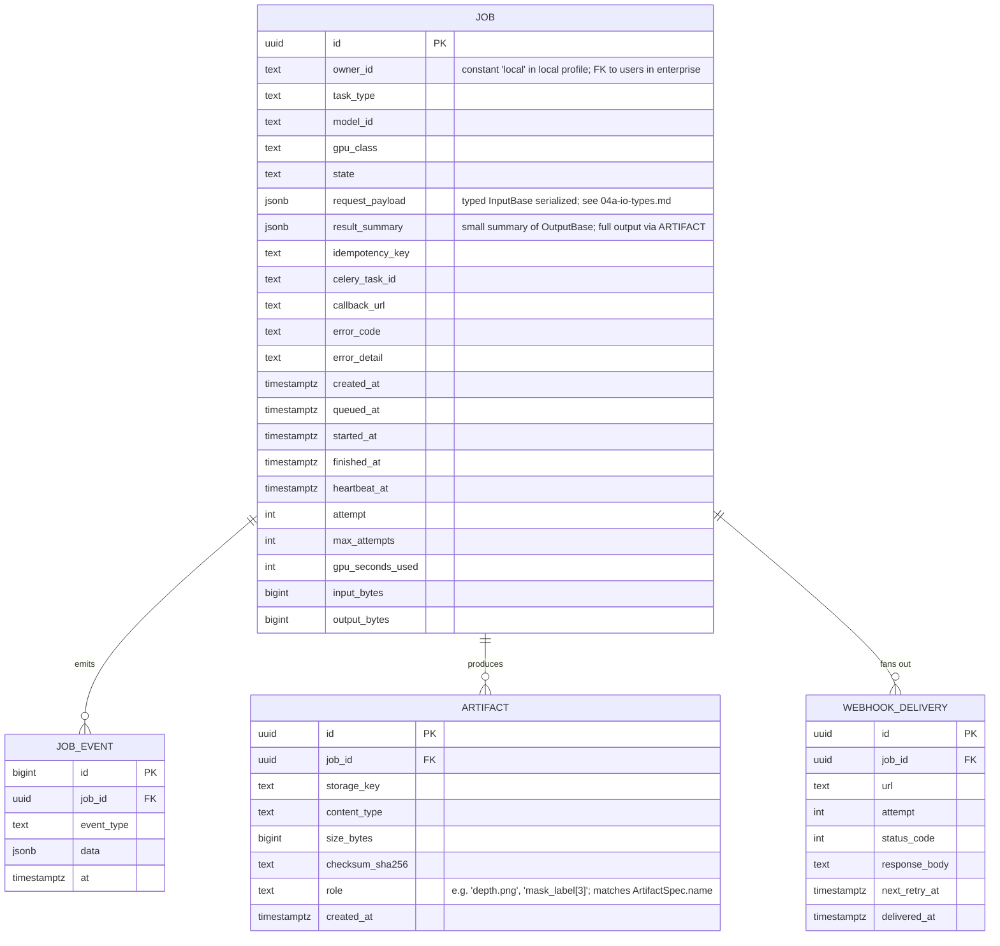
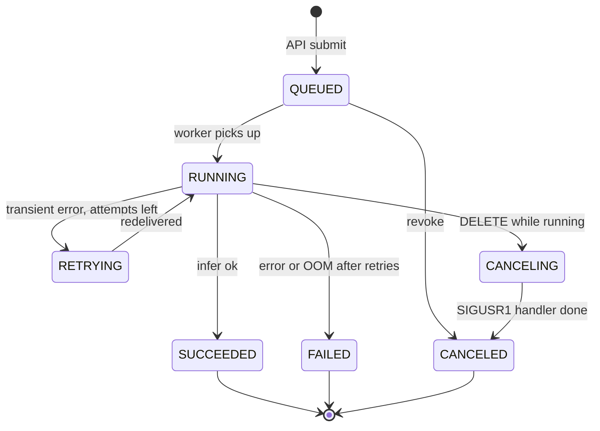

# 02 — Data Model

This document defines the Postgres schema, the job state machine, and the Redis structures that hold short-lived state. It is the source of truth for `packages/db/models.py` and the first Alembic migration.

The schema below is the **local profile** schema. Multi-tenant additions (`tenants`, `users`, `api_keys`, `tenant_quotas`, `audit_events`) live in [`enterprise/01-multi-tenancy-and-auth.md`](../enterprise/01-multi-tenancy-and-auth.md). They are added by additive Alembic migrations on top of the local schema — never modified into the local rows.

## ER diagram (local profile)



## Why `owner_id` survives without users

Every row carries `owner_id` from day 1, with the constant value `"local"` in the local profile. This:

- Keeps repository code identical between local and enterprise (always filters `WHERE owner_id=:principal.owner_id`).
- Lets the enterprise migration add a real `users` table and a FK constraint without rewriting the `jobs` schema.
- Makes the SQL state-guard predicates ([§State machine](#state-machine)) verbatim portable.

The string vs UUID choice is intentional: the local constant is a string; enterprise migrations cast or alias it. Alembic migration `0002_enterprise_users.py` documents the conversion.

## State machine



### Transition rules

All transitions are enforced at the SQL layer with a guard predicate. The worker never trusts in-process state.

| From | To | Allowed by | Predicate |
|---|---|---|---|
| `QUEUED` | `RUNNING` | worker | `state='QUEUED' AND celery_task_id=:tid` |
| `QUEUED` | `CANCELED` | API | `state='QUEUED'` |
| `RUNNING` | `SUCCEEDED` | worker | `state='RUNNING' AND celery_task_id=:tid` |
| `RUNNING` | `FAILED` | worker | `state='RUNNING' AND celery_task_id=:tid` |
| `RUNNING` | `RETRYING` | worker | `state='RUNNING' AND celery_task_id=:tid AND attempt < max_attempts` |
| `RETRYING` | `RUNNING` | worker | redelivered, new `:tid` written |
| `RUNNING` | `CANCELING` | API | `state='RUNNING'` |
| `CANCELING` | `CANCELED` | worker (SIGUSR1 handler) | `state='CANCELING'` |
| `RUNNING` (orphan) | `FAILED` | reconciler (beat) | `state='RUNNING' AND heartbeat_at < now() - interval '90s'` |

`UPDATE … RETURNING` is the contract: zero rows returned means another writer beat us; the loser logs and exits without retry.

## Indices

```sql
-- hot read paths
CREATE INDEX idx_jobs_owner_created  ON jobs (owner_id, created_at DESC);
CREATE INDEX idx_jobs_state          ON jobs (state) WHERE state IN ('QUEUED','RUNNING','RETRYING','CANCELING');
CREATE UNIQUE INDEX uq_jobs_idem     ON jobs (owner_id, idempotency_key) WHERE idempotency_key IS NOT NULL;

-- reconciler
CREATE INDEX idx_jobs_heartbeat      ON jobs (heartbeat_at) WHERE state IN ('RUNNING','CANCELING');

-- artifacts and webhooks
CREATE INDEX idx_artifacts_job       ON artifacts (job_id);
CREATE INDEX idx_webhook_retry_due   ON webhook_deliveries (next_retry_at)
    WHERE delivered_at IS NULL;
```

The enterprise schema adds `idx_jobs_tenant_created (tenant_id, created_at DESC)` and the `audit_events` partition strategy.

## Idempotency

`Idempotency-Key` is required on every state-mutating POST.

- Scope: `(owner_id, key)`.
- Storage: Redis `SET idem:{owner_id}:{key} {job_id} NX PX 86400000`.
- On replay (same key, same body hash): return the original `job_id` with `200 OK` and a header `X-Idempotent-Replay: true`.
- On replay (same key, different body hash): `409 Conflict` with `error.code = idempotency_conflict`.

The unique index `uq_jobs_idem` is the durable backstop if Redis is wiped.

## Request payloads — typed I/O

`request_payload` JSONB stores the serialized `InputBase` instance from [04a-io-types.md](./04a-io-types.md). The discriminator is `input_type`:

```json
{
  "version": "1",
  "input_type": "image_text",
  "image": { "storage_key": "s3://.../uploads/local/abc.jpg", "content_type": "image/jpeg" },
  "queries": [{ "text": "cat", "regularize": false }]
}
```

`result_summary` JSONB carries a *small* summary suitable for inclusion in `GET /v1/jobs/{id}` responses without proxying large blobs. The full output is reconstructed from `ARTIFACT` rows + the typed `OutputBase` schema:

```json
{ "version": "1", "output_type": "depth_map", "n_artifacts": 2, "min_depth": 0.41, "max_depth": 18.7, "units": "meters" }
```

The role field on `ARTIFACT` matches `ArtifactSpec.name` from `OutputBase.serialize_artifacts()`. Clients reconstruct the typed output by combining the summary + presigned artifact URLs.

## Redis layout

| Key pattern | Type | TTL | Purpose |
|---|---|---|---|
| `idem:{owner}:{key}` | string | 24 h | Idempotency cache |
| `rl:{owner}:{bucket}` | hash | refresh on use | Token-bucket state |
| `lock:model:{model_id}` | string (NX) | 10 min | First-load coordination |
| `lock:beat` | string (NX) | 30 s | Celery-beat leader election |
| `pubsub:job.events` | channel | n/a | SSE fan-out |
| `pubsub:job.{id}` | channel | n/a | Per-job stream for SSE |
| `worker:{worker_id}:ready` | string | 30 s | Capability advertisement (refreshed every 10 s) |
| Celery internal keys | various | per Celery | `celery`, `unacked_*`, `kombu.binding.*` |

## Migration policy

- All schema changes via Alembic.
- Forward-compatible by default: add nullable columns, backfill, then make NOT NULL in a second migration.
- No `DROP COLUMN` in the same release that stops writing it.
- Migrations are idempotent and resumable.
- Enterprise schemas are **additive** on top of local; running enterprise migrations on a fresh DB always works after the local migration ran first.

## Test data

`scripts/seed_dev_data.py` seeds: nothing in `jobs` (job rows are created by submission). The static API key is read from `.env` and is *not* stored in the DB in the local profile. Sample image and multi-view fixtures land in `tests/fixtures/` for the e2e suite.
